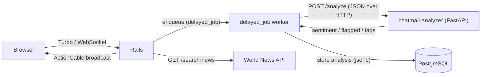
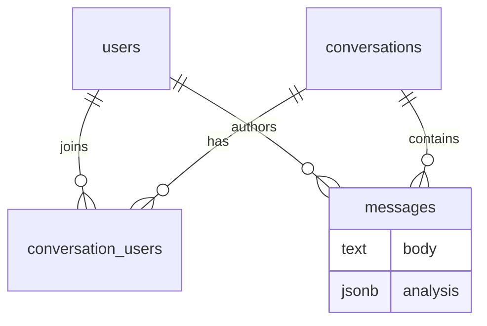

# chatmail

[](https://github.com/smyk-git/chatmail/actions/workflows/ci.yml)

chatmail is a real-time messaging application: users sign up, start
conversations and exchange messages that appear live for every participant
without a page reload. It also carries a small news section, and every message
is scored by a separate analysis microservice.

## Stack

- **Ruby** 3.3.0, **Rails** 7.2
- **PostgreSQL**
- **Devise** — authentication
- **Hotwire** (Turbo / Stimulus) + **importmap-rails** — frontend
- **ActionCable** — real-time message delivery over WebSockets
- **delayed_job** (`delayed_job_active_record`) — background jobs
- **whenever** — cron-style recurring tasks
- **rack-attack** — rate limiting
- **HTTParty** — HTTP client for the analyzer and the news API
- **RSpec**, **FactoryBot**, **Capybara** + **SimpleCov** — tests & coverage
- **Rubocop** (omakase + rubocop-rspec), **Brakeman** — linting & security

## Architecture

chatmail is a Rails monolith paired with a standalone Python microservice,
[**chatmail-analyzer**](https://github.com/smyk-git/chatmail-analyzer), that
scores messages (sentiment, offensive-language flag, tags).



**How the two services talk.** When a message is created, an `after_create`
hook enqueues a `MessageAnalysisJob` on delayed_job. The worker calls the
analyzer over HTTP:

- **Endpoint:** `POST http://localhost:9000/analyze`
- **Request** (JSON): `{ "message_id", "user_id", "conversation_id", "text" }`
- **Response** (JSON): `{ "sentiment": "positive|neutral|negative", "flagged": true|false, "tags": [...] }`

The result is stored on the message's `analysis` (`jsonb`) column. Keeping the
call in a background job means a slow or unavailable analyzer never blocks the
request/response cycle — the message is delivered live regardless.

### Data model



## Running locally

**Requirements:** Ruby 3.3.0, PostgreSQL, and (optionally) Python 3 to run the
analyzer.

```bash
bin/setup                     # install gems, prepare the database
bin/rails db:seed             # optional: demo account + sample conversation
bundle exec rails server      # http://localhost:3000
bundle exec rake jobs:work    # background worker (mailers, message analysis)
```

To get live message scoring, also run the analyzer on port 9000 (see its
[README](https://github.com/smyk-git/chatmail-analyzer)):

```bash
uvicorn app.main:app --port 9000
```

### Environment variables

Set via a `.env` file (dotenv) — values omitted here:

| Variable              | Used for                                       |
| --------------------- | ---------------------------------------------- |
| `WORLDNEWS_API_KEY`   | the news section (World News API)              |
| `DATABASE_URL`        | database connection (used by Docker / prod)    |
| `RAILS_MASTER_KEY`    | decrypting credentials in production           |

### With Docker

The whole dev stack (Rails + PostgreSQL) starts with one command:

```bash
docker compose up            # app on http://localhost:3000
```

## Tests

```bash
bundle exec rspec            # run the suite
```

SimpleCov writes an HTML coverage report to `coverage/index.html` after each
run, and the suite fails if coverage drops below the configured floor.

## Demo account

After `bin/rails db:seed`:

- **Email:** `demo@chatmail.dev`
- **Password:** `password123`

The demo account already shares a seeded conversation with a second user.

## Design decisions

- **delayed_job instead of Sidekiq.** Jobs live in PostgreSQL, so there's no
  Redis to run and one data store backs both records and the queue. Enqueue
  happens in the same DB transaction as the data it depends on, and the
  `delayed_jobs` table can be queried with plain ActiveRecord — handy for
  visibility into what's pending or failing.
- **A separate analyzer microservice instead of an in-app service.** Message
  analysis fits Python's ecosystem, and splitting it out keeps that
  responsibility isolated, independently deployable/scalable, and makes the
  HTTP integration between two services explicit.
- **ActionCable for real-time.** It's native to Rails and integrates with
  Hotwire/Turbo, so messages are pushed instead of polled without adding a
  third-party real-time provider or extra infrastructure.
